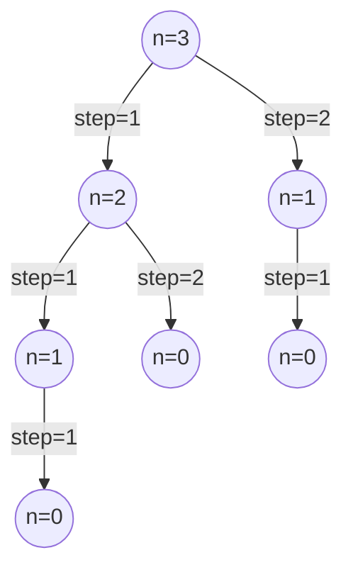

<!-- ## What is Dynamic Programming -->


<!-- ## How to use Dynamic Programming -->


As an algorithm, what kind of problems can dynamic programming solve?

First, let's check out a problem [Climbing Stairs](https://leetcode.com/problems/climbing-stairs/description/){:target="_blank"} from LeetCode.

> You are climbing a staircase. It takes n steps to reach the top.
Each time you can either climb 1 or 2 steps. In how many distinct ways can you climb to the top?

Every time you can choose **1** or **2** steps, so it's natural to think of building a binary tree in which the two paths refer to 2 kinds of steps. We assume the number **n** is 3, then the tree can be illustrated as below.



And now, it's easy to know that the answer is the number of the tree's leaves. Then it can be written down as below.

```c++
int climbStairs(int n) {
    if (n == 0) {return 0;}
    int count = 0;
    climbStairs(n, count);
    return count;
}

void climbStairs(int n, int& count) {
    if (n == 0) {
        count++;
    } else if (n > 0) {
        climbStairs(n-1, count);
        climbStairs(n-2, count);
    }
}
```

But is it fast? Or can we figure its complexity out? As we all know, a complete binary tree's leaves's count depends on its height, and we can easily to say it's $(2^h)$ if we assume that the height of the root is 0. 

Though the tree is obvious not complete, it's still useful to calculate its leaves count treating it as complete, because we can use its highest height which all of its path is **1** to get the upper boundary of the complexity and use its lowest height which all of its path is **2** to get the lower boundary of the complexity. 

Now it's apparent that the most count is $(2^{n})$ and the least count is $(2^{\frac{n}{2}})$, so the complexity is between $O(2^{\frac{n}{2}})$ and $O(2^n)$.

And can you get an accurate complexity? Try it yourself!

But as we can see, it's too slow. Is there a faster way?

Let's take a look at the tree above, when we choose an **1-1** path or a **2** path, the rest parts which are 1 are the same, which means we calculate the same parts two times! Can we write down them at a notebook in case we run into them again? The answer is *YES*! We can use a function called `c(n)` to refer to the count of the distinct ways when we have **n** steps to climb, and it has this equation $c(n) = c(n-1) + c(n-2)$, then we can record the value of `c(n)` in an array **note**. Now we can write the code as below.

```c++
int climbStairs(int n) {
    if (n == 0) {return 0;}
    vector<int> note = vector<int>(n+1, 0);
    note[0] = 1;
    return climbStairs(n, note);
}

int climbStairs(int n, vector<int>& note) {
    if (n >= 0) {
        if (note[n]) { return note[n]; }
        int sum = climbStairs(n-1, note) + climbStairs(n-2, note);
        note[n] = sum;
        return sum;
    }
    return 0;
}
```

It's fast, but how fast is it? Its structure just looks like the same as what it was when not using a notebook, how can we calculate the complexity?

Let's consider the tree's leftest path, there are all **1** steps, and after the `climbStairs(n-1, note)` returns, the `note[n-2]` will have been known, so the `climbStairs(n-2, note)` will return immediately. So we can say the time this algorithm costs is $O(n)$. From $O(2^n)$ to $O(n)$, what a big improvement!

But is there any more enhancement? Do we have to use a recursive function, since it will cost more time and memory every time it calls itself? The answer is still YES.

As we know that `c(n)` depends on `c(n-1)` and `c(n-2)`, so what if we've already known the value of `c(n-1)` and `c(n-2)` when we meet `c(n)`? The answer is we could calculate the value of `c(n)` immediately! So, below is the code:

```c++
int climbStairs(int n) {
    if (n == 0) {return 0;}
    int note[n+1];
    note[0] = 1; note[1] = 1;
    for (int i = 2; i <= n; i++) {
        note[i] = note[i-1] + note[i-2];
    }
    return note[n];
}
```

So far, we solve the first problem using dynamic programming. So we can realize that it's important to find out a smaller part of the original problem, and use its result to deduce the bigger one's result. We call this smaller part of problem as **optimal substructure**. Then we can get a equation like $c(n) = c(n-1) + c(n-2)$ as we discussed above. Some more complicated problem may have mutiple arguments or be difficult to figure out **optimal substructure**. 

To know more, you may want to read the part2.