## Introduction to Regular Expression

### What Is Regualar Expression

As a developer, we may be more or less familiar with **regular expression**(also known as **regex** or **regexp**). It is a way to decribe a string pattern with which we can tell whether a string is needed or locate a special piece of text in an article.

### Why Regular Expression

Assuming you are told to delelop a website's login page, users can enter their email to login, and we all know that an email is like `username@companyname.urlsuffix`, but how to describe it? An easy way is to use **regular expression** to describe the email like this `[\w.%+-]+@[\w.-]+\.[a-zA-Z]+`.

### What's in Regular Expression

Let's take an easiest **mathematical expression** `1 + 1` as an example, we use two **numbers** and one **mathematical operation** to form a **mathematical expression**, and the result is still a **number**.

Like the **mathematical expression**, **regular expression** has similar components, we call them **regular language** and **regualar operation**.

Before to answer what is **regular language** and **regualar operation**, we need to introduce a new model called **Finite Automaton**.

## Finite Automaton

> "A **finite automaton**, **finite-state machine** (FSM) or **finite-state automaton** (FSA, plural: automata), or simply a **state machine**, is a mathematical model of computation". -Wikipedia

### A Simple Finite Automaton

Assuming that you are told to design an automatic door controller with 2 states(*OPEN* and *CLOSED*), it can receive 4 signals(*FRONT* standing for there's someone in the front of the door and *REAR* standing for there's someone in the rear of the door, *BOTH* standing for there's someone in front and rear of the door and *NEITHER* standing for there's noone in front or rear of the door). Then we can figure out an diagram as below:

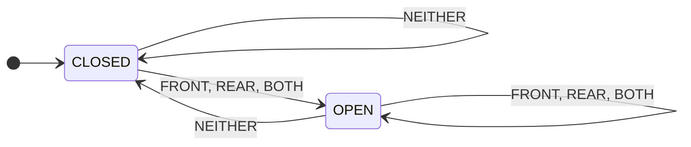

And we just get a simple finite automaton.

### Deterministic Finite Automaton (*DFA*)

Here is a more abstract diagram.

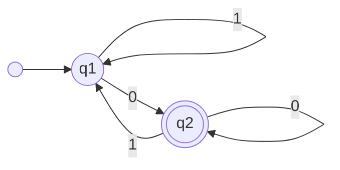

$M_1$ above is a **state diagram** which has 2 states called $q_1$ and $q_2$. $q_1$ is a **start state** pointed by a single pointer, $q_2$ is an **accept state** with concentric circles. A pointer pointing from one state to another is called **transition**.

When $M_1$ receives a string assuming it's `1010`, then it runs as steps below:
1. Starts at $q_1$.
2. Reads 1, stays $q_1$.
3. Reads 0, transits to $q_2$.
4. Reads 1, transits to $q_1$.
5. Reads 0, transits to $q_2$.
6. Ends at $q_2$, since $q_2$ is an **accept state**, this string is accepted by $M_1$.

By testing a few strings with $M_1$, we can find that $M_1$ accepts strings which end with 0.

A finite automaton like $M_1$ is called **Deterministic Finite Automaton**(DFA).

Now we can define *DFA* as a 5-tuple, $(Q, \Sigma, \delta, q_0, F)$, and:
1. $Q$ is a finite set called **state set**.
2. $\Sigma$ is a finite set called **alphabet**.
3. $\delta: Q \times \Sigma \rightarrow Q$ is a **transition function**.
4. $q_0 \in Q$ is a **start state**.
5. $F \subseteq Q$ is a **set of accept states**.

So, $M_1$ can be defined as $(Q, \Sigma, \delta, q_0, F)$, and:
1. $Q = \\{q_1, q_2\\}$
2. $\Sigma = \\{0, 1\\}$
3. $\delta$ can be described as

|       | 0     | 1     |
| ----- | ----- | ----- |
| $q_1$ | $q_2$ | $q_1$ |
| $q_2$ | $q_2$ | $q_1$ |

4. $q_1$ is a **start state**
5. $F = \\{q_2\\}$

### Nondeterministic Finite Automaton (*NFA*)

Here is a simple *NFA* $N_1$:

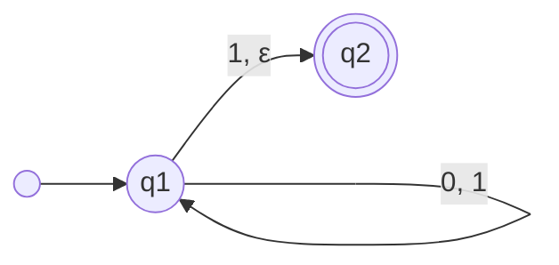

As we can see, there are 2 pointers starting from $q_1$, which means when the NFA's state is $q_1$, meanwhile if it receives `1`, the result is 2 different states. And there is an $\varepsilon$ on the pointer starting from $q_1$ to $q_2$, which means the *NFA* can receive an empty char so that it can transit from $q_1$ to $q_2$ without consuming any chars in string. Besides, there is also no pointer starting from a state like $q_2$.

Since the *NFA* might have diffenent states, it assumes all of the states can lead to the right result, and it will split into the number of the states, each automaton will excuse the rest part of the string.

Let's take a string `010` as an example. Its excusing path is illustrated as below:

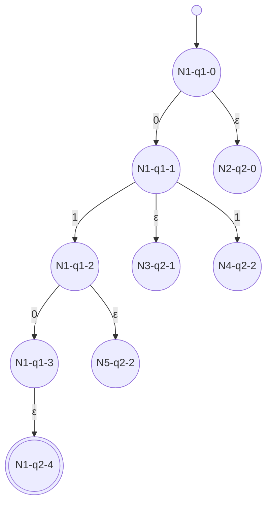

> *Nx* means the name of *NFA*, *qx* means the current state of the *NFA*, and the number at the right side of the second '-' means how many numbers in string it has consumed(including the *NFA* it splited from).

The *NFA* *N1* starts from *q1*, because it can receive an $\varepsilon$ at *q1*, it will split a new *NFA* *N2*. After *N1* consumes a `0`, its state is still *q1*, so it can split a new *NFA* *N3* again by receiving an $\varepsilon$, and at this time, since the next number is `1`, it will split a new *NFA* *N4*. Keeping folliwing *N1*, now it is at *N1-q1-2*, like previous examples, *N1* will split a new *NFA* *N5* and comsume `0` from string. But though *N1*'s state is *q1*, and it will receive another $\varepsilon$, for no more numbers in string, it won't split again, and the final position is *N1-q2-4*. By the way, other *NFA*'s states are *q2*, and an *NFA* can receive nothing at *q2*, so they are all "dead" which means the *NFA* doesn't accept this string. However it doesn't matter, because only if there is an *NFA* accepts, then we say the *NFA* accepts the string, and in this example *N1* accepts.

Thus, the string `010` is accepted by this *NFA*.

In a *DFA*, the result of transition function $\delta$ is always a single state $q \in Q$, so its excusing path is always one by one. But due to the nondeterminism, in an *NFA*, the result of its $\delta$ is a state set, so its excusing path can be forked.

Like a *DFA*, we can also define the *NFA* as a 5-tuple, $(Q, \Sigma, \delta, q_0, F)$, and:
1. $Q$ is a finite set called **state set**.
2. $\Sigma$ is a finite set called **alphabet**.
3. $\delta: Q \times \Sigma_\varepsilon \rightarrow P(Q)$ 
is a **transition function**, and $\Sigma_\varepsilon = \Sigma \cup \varepsilon, P(Q) = \\{A\ |\ A \subseteq Q\\}$ AKA **power set**.
4. $q_0 \in Q$ is a **start state**.
5. $F \subseteq Q$ is a **set of accept states**.

So, $N_1$ can be defined as $(Q, \Sigma, \delta, q_0, F)$, and:
1. $Q = \\{q_1, q_2\\}$
2. $\Sigma = \\{0, 1\\}$
3. $\delta$ can be described as

|       | 0             | 1                | ε             |
| ----- | ------------- | ---------------- | ------------- |
| $q_1$ | $\\{q_2\\}$   | $\\{q_1, q_2\\}$ | $\\{q_2\\}$   |
| $q_2$ | $\varnothing$ | $\varnothing$    | $\varnothing$ |

4. $q_0=\\{q_1\\}$
5. $F = \\{q_2\\}$

### Relationship Between *DFA* and *NFA*

> **THEOREM 1**: Given an *NFA*, we can always find a *DFA* which is able to recognize the same language.

Since the result of an *NFA*'s $\delta$ is one of the sets in $P(Q)$, we can treat the set as a state in the target *DFA*.

Assuming an *NFA* 5-tuple is $(Q_1, \Sigma_1, \delta_1, q_1, F_1)$, then we can construct a *DFA* 5-tuple $(Q_2, \Sigma_2, \delta_2, q_2, F_2)$ like this:

1. $Q_2 = P(Q_1)$
2. $\Sigma_2 = \Sigma_1$
3. For $A \subseteq Q_2\ and\ r \in \Sigma_2,\ \delta_2(A,r) =  \underset {a\in A} \cup \delta_1(a,r)$, 
which means for each $a \in A$, first we get $S = \delta_1(a,r)$, then we will have these sets: $S_1,S_2\cdots S_n(n=|A|)$, in the end, we get the result $S = \\{a\ |\ a\in S_1\ or\ a\in S_2 \cdots \ or\ a\in S_n\\}$
4. $q_2 = \\{q_1\\}$
5. $F_2 = \\{A \ | \ A \subseteq Q_2 
\ and \ at \ least \ one \  a \in A, \ a \in F_1 \\}$

However, we haven't discussed about $\varepsilon$ above, when we calculate $\delta_2$, assuming the result is **S**, we need to consider every $a \in S$, if $A=\delta_1(a,\varepsilon)\ and\ A\neq \varnothing$, then we ought to take all $a^, \in$ these $A$ into the result $S$, and also, considering $A^, =\delta_1(a^, ,\varepsilon)$ still matters. We should do these same steps until there's no more $A\neq \varnothing$.

Let's take a look at the $N_1$ discussed in [NFA](#nondeterministic-finite-automaton-nfa) above, its **start state** is *q1*, but there is an $\varepsilon$ pointer starting from *q1* to *q2*, so at a *DFA*, its **start state** is *{q1,q2}*.

Now we can easily transfer $N_1$ into a *DFA* like this:
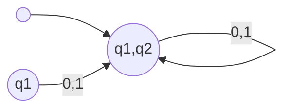

And there's no way to get into *q1*, so we can simplify the *DFA* as below:
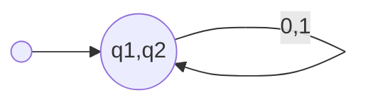

As we can see, this *DFA* can recognize the same language as $N_1$.

### Generalized Nondeterministic Finite Automaton (*GNFA*)

The biggest difference between a *GNFA* and an *NFA* is the *GNFA* can not only receive a single $char \in \Sigma$ or an $\varepsilon$, but also receive a regular expression. A simple *GNFA* can be like below:

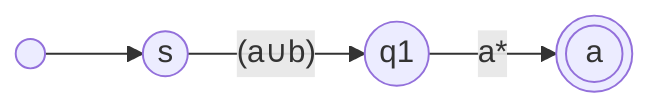

We define *GNFA* as a 5-tuple, $(Q, \Sigma, \delta, q_{start}, q_{accept})$, and:
1. $Q$ is a finite set called **state set**.
2. $\Sigma$ is a finite set called **alphabet**.
3. $\delta: (Q-{q_{accept}}) \times (Q-{q_{start}}) \rightarrow R$ is a **transition function**.
4. $q_{start} \in Q$ is a **start state**.
5. $q_{accept} \in Q$ is an **accept state**.

And we can define a CONVERT(G) to transform a *DFA* to a *GNFA*:
1. Assuming $k$ is the count of G's states.
2. If $k=2$, then G consists of a start state, an accept state and a pointer which is marked with a regular expression $R$. And this $R$ is what we need.
3. if $k>2$, choose a state $q_{rip} \in (Q-\\{q_{start}, q_{accept}\\})$, define $G^,$ as a *GNFA* $(G^,, \Sigma, \delta^,, q_{start}, q_{accept})$, and $Q^,=Q-\\{q_{rip}\\}$, for every $q_i \in Q^,-\\{q_{start}\\}$ and $q_j \in Q^,-\\{q_{accept}\\}$, let $\delta^,(q_i, q_j) = (R_1)(R_2)*(R_3)\cup(R_4)$ ( $R_1=\delta(q_i, q_{rip}), R_2=\delta(q_{rip},q_{rip}), R_3=\delta(q_{rip},q_j), and R_4=({q_i,q_j})$ )
4. Calculate CONVERT($G^,$), return the value.

> For any *GNFA* G, CONVERT(G) = G.

Given a *DFA* as below:

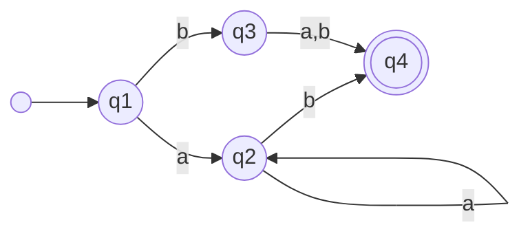

We can transform it into a *GNFA* following steps below:

1. Add start state and accept accept:
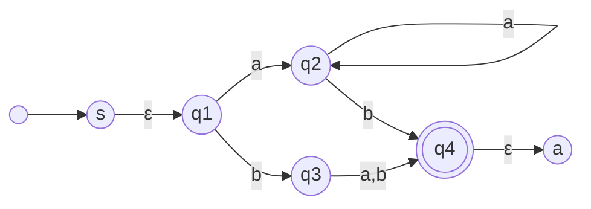

2. Replace q2 with aa*b:
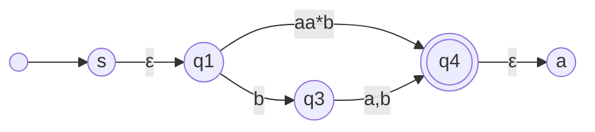

3. Replace q3 with b(a∪b):
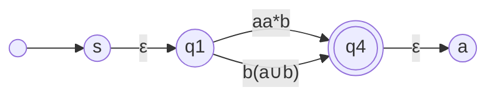

4. Merge pointers between q1 and q4:
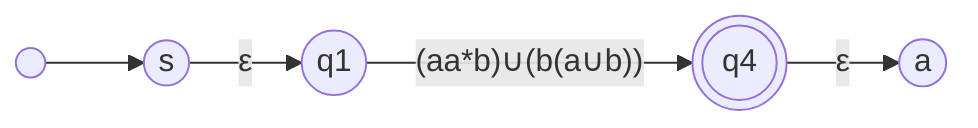

5. Remove q1 and a4:
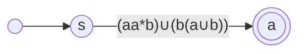

The expression (aa*b)∪(b(a∪b)) is what we need, and it is exactly the same as the *DFA*.

<!-- By now, we've learnt 2 types of *finite automaton*, and there are also another types, you can read *push down automaton* hear. -->

## Dive Into Regular Expression

As we discussed in [What's in Regular Expression](#whats-in-regular-expression), ,we introduced *regular language* and *regular operation*, at this section, we will focus on them.

### Regular Language

Assuming $M = (Q, \Sigma, \delta, q_0, F)$  is a *DFA*, $w=w_0w_1 \cdots w_n (w_i \in \Sigma)$ is a string. If there is a state sequence $r_0, r_1, \cdots, r_n$, meeting the conditions below:
1. $r_0 = q_0$
2. $\delta (r_i, w_{i+1}) = r_{i+1}, i = 0, 1, \cdots, n-1$
3. $r_n \in F$

Then we say $M$ *accepts* w.

If $A = \\{w|M\ accepts\ w\\}$, 
then **M recognizes w**.

> **THEOREM 2**: If a language can be recognized by a *DFA*, it is called **regular language**

### Regular Operation

We define **regular operation**s as below:
1. union: 
$A \cup B = \\{x\ |\ x \in A \ or \ x \in B\\}$

2. concatenation: 
$A ○ B = \\{xy\ |\ x \in A \ and \ y \in B\\}$

3. star: 
$A^* = \\{x_1x_2\cdots x_k \ | \ k \geq \ 0 \ and\ x_i \in A \\}$

As a mathematic operation's result is also a number, we need to prove a regular operation's result is still a regular language.

#### Union

> **THEOREM 3**: If $A_1$ and $A_2$ are regular languages, then $A_1 \cup A_2$ is a regular language.

As we discussed in [DFA](#deterministic-finite-automaton-dfa), we know that there is a $M_1$ and a $M_2$ can recognize $A_1$ and $A_2$ separately, since we want to prove that *$A_1 \cup A_2$ is a regular language*, then we need to prove that *there is a $M$ who can recognize $A_1 \cup A_2$*.

Let's define $M_1$ as $(Q_1, \Sigma_1, \delta_1, q_1, F_1)$, $M_2$ as $(Q_2, \Sigma_2, \delta_2, q_2, F_2)$ and $M$ as $(Q, \Sigma, \delta, q_0, F)$, then we can figure $M$ out as below:
1. $Q = \\{(r_1, r_2)\ |\ r1\in Q_1 
\ and \ r_2 \in Q_2\\}$
2. $\Sigma = \Sigma_1 \cup \Sigma_2$
3. for $(r_1,r_2) \in Q \ and \ a \in \Sigma$, then $\delta((r_1, r_2), a) = (\delta_1(r_1, a), \delta_2(r_2, a))$
4. $q_0 = (q_1,q_2)$
5. $F = \\{(r_1,r_2) \ |
\ r_1 \in F_1 \ or \ r_2 \in F_2\\}$

For now, we've generated a DFA $M$ recognizing language $A_1 \cup A_2$ which means the result of $A_1 \cup A_2$ is still a **regular language**.

If we use *NFA*, it will be easier to understand, assuming $N_1$ and $N_2$ can recognize $A_1$ and $A_2$ separately, we can construct $N$ to recognize $A_1 \cup A_2$ as below:

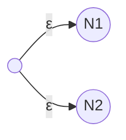

> Pointers should point to $N_1$ and $N_2$'s **start state**.
{: .prompt-tip }

We let the $N$ itself to deduce whether $N_1$ or $N_2$ can recognzie the new language.

#### Concatenation

> **THEOREM 4**: If $A_1$ and $A_2$ are regular languages, then $A_1 ○ A_2$ is a regular language.

Assuming $N_1$ and $N_2$ can recognize $A_1$ and $A_2$ separately, using $N_1$ and $N_2$, we can construct another *NFA* $N$ as illustrated below:

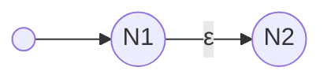

> The pointer with $\varepsilon$ should start from $N_1$'s **accept state**s and point to $N_2$'s **start state**. And the ○ can be omitted for convenience.
{: .prompt-tip }

#### Star

> **THEOREM 5**: If $A$ is a regular language, then $A^*$ is a regular language.

Assuming $N$ can recognize $A$, with $N$, we can construct another *NFA* $N^,$ as illustrated below:

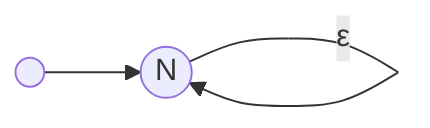

> The pointer with $\varepsilon$ should start from $N$'s **accept state**s and point to $N$'s **start state**.
{: .prompt-tip }

### Regular Expression

> **THEOREM 6**: We say R is a regular expression, if R is:
1. $a,\ a \in \Sigma$
2. $\varepsilon$
3. $\varnothing$
4. $(R_1 \cup R_2),\ R_1\ and\ R_2$ are regular expressions.
5. $(R_1 ○ R_2),\ R_1\ and\ R_2$ are regular expressions.
6. $(R_1^*),\ R_1$ is a regular expression.

Assuming $L(R)$ is the language that expression R can recognize. So, given a regular expression $[ab]*[cd]$, we can have some basic languages:
1. $L(R_1) = a$
2. $L(R_2) = b$
3. $L(R_3) = c$
4. $L(R_4) = d$

Then they can be put together like this: $((R_1 \cup R_2)*)\ ○\ (R_3 \cup R_4)$ which is the same as $[ab]*[cd]$. And no matter how complicated the expression is, it can always be traslated into the $L(R)$ format as above which is just another form of **regular expression**.

> **THEOREM 7**: A language is regular, if and only if we can use regular expression to describe it.

To prove this theorem, we need to prove it in two directions, and they can be discribed as two lemmas.

> **LEMMA 1**: If a language can be discribed with a regular expression, then it is regular.

Assuming the expression is R, and R may have regular operations, as being proved in [Regular Operation](#regular-expression), we can always construct a *DFA* to recognize it, and with **THEOREM 2** in [Regular Language](#regular-language), **LEMMA 1** is proved.

> **LEMMA 2**: If a language is regular, then it can be discribed with a regular expression.

When a language is regular, we can find a *DFA* recognizing it. To figure out how a *DFA* transfers into a regular expression, we need another finite automaton *GNFA* introduced in [GNFA](#generalized-nondeterministic-finite-automaton-gnfa). With those steps, we can get a regular expression from a *DFA*.

With **LEMMA 1** and **LEMMA 2**, we have proved **THEOREM 7**.

So, to recognize the language a regular expression referring to, we just need to implement a *DFA*. If you want to know how to implement a *DFA*, you can read Implement a Tiny Regular Expression.

In the end, I want to recommand a great book, Michael Sipser's "Introduction to the Theory of Computation", from which I've learnt a lot about the finite automaton.