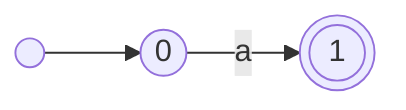
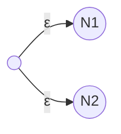
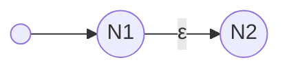
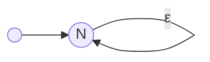

## A Simple Example

First, let's take a look at an easy regex example from [LeetCode](https://leetcode.com/problems/regular-expression-matching/description/){:target="_blank"}.

> Given an input string s and a pattern p, implement regular expression matching with support for '.', '*' and:
- '.' Matches any single character.​​
- '*' Matches zero or more of the preceding element.
- The matching should cover the entire input string (not partial).

As we discussed in [A Deeper Understanding of Regular Expression](/posts/a-deeper-understanding-of-regular-expression/), in order to get selected substring with the pattern from the string, we should construct an *NFA* first.

## Define *NFA*

An easiest *NFA* may be like below:



It has 2 states, and accepts `a`. So, it can be defined as a 5-tuple $(Q, \Sigma, \delta, q_0, F)$, and:
1. $Q = \\{0, 1\\}$
2. $\Sigma = \\{a \ \|\ a \in ASCII \\}$
3. $\delta$ can be described as

|     | a             | other symbols |
| --- | ------------- | ------------- |
| $0$ | $\\{1\\}$     | $\varnothing$ |
| $1$ | $\varnothing$ | $\varnothing$ |

4. $q_0 = \\{0\\}$
5. $F = \\{1\\}$

Now, we can define a class `NFA` as below:

```c++
class NFA
{
    int Q; // Due to all the states are numbers, we can use the count of states to represent all possible states, and the range is 0-(Q-1).
    set<char> Σ;
    vector<map<char, set<int>>> δ;
    int q; // The start state.
    set<int> F;
};
```

## Operate *NFA*

According to the theory of regex we discussed in [A Deeper Understanding of Regular Expression](/posts/a-deeper-understanding-of-regular-expression/), we also need 3 operations: **union**, **concatenation**, **star**

### Add Union

Union is like this



So, we can implement it as below:

```c++
// First, we should define ε in NFA, and assume we won't use this value in NFA's symbols.
const char ε = -1;

void makeUnion(const NFA& n)
{
    if (n.Q == 0) { return;}
    if (Q == 0) {
        *this = n;
        return;
    }

    // 1. Add an extra state as its new start state;
    δ.insert(δ.begin(), {});

    // 2. Give the start state transitions to let it can transit to both NFAs' start state when receiving ε.
    δ[0][ε] = {q+1, n.q+Q+1};

    // 3. Update ε's states in this NFA
    for (int i = 1; i <= Q; i++) {
        for (auto s in δ[i]) {
            s.second++;
        }
    }

    // 4. Add n's states to δ
    for (int i = 0; i < n.Q; i++) {
        set<int> tempmap = {};
        for (int s: n.δ[i]) {
            tempmap[s.first] = s.second + Q + 1;
        }
        δ.emplace_back(tempmap);
    }

    // 5. Update F, Q and q
    for (int s: F) {
        s += 1;
    }
    for (int s: n.F) {
        F.insert(s + Q + 1);
    }
    Q += n.Q + 1;
    q = 0;
}
```

### Add Concatenation

Concatenation is like this:



And, it can be imlemented as below:

```c++
void makeConcatenation(const NFA& n)
{
    if (n.Q == 0) { return;}
    if (Q == 0) {
        *this = n;
        return;
    }

    // 1. Add to all states in F an ε transition with which can transit to n's start state.
    for (int s: F) {
        δ[s][ε].insert(n.q + Q);
    }

    // 2. Add n's states to δ
    for (int i = 0; i < n.Q; i++) {
        set<int> tempmap = {};
        for (int s: n.δ[i]) {
            tempmap[s.first] = s.second + Q;
        }
        δ.emplace_back(tempmap);
    }

    // 3. Update F and Q
    F.clear();
    for (int s: n.F) {
        F.insert(s + Q);
    }
    Q += n.Q;
}
```

### Add Star

Star is like this:



And we can implement it as below:

```c++
void makeStar(void)
{
    if (Q == 0) { return; }

    // 1. Add to all states in F the ε transition
    for (int s: F) {
        δ[s][ε].insert(q);
    }

    // 2. Update F
    F = {q};
}
```

## Use *NFA*

Because the *NFA*'s transition result (AKA δ[state][symbol]) is a set, we need to collect all possible states in each trasition including those ε-reachable states.

### Calculate ε-Reachable States

```c++
set<int> calculateEpsilonReachableStates(const set<int>& states)
{
    set<int> res = states;
    queue<int> statesNeedCalculate = states;
    while(!statesNeedCalculate.empty()) {
        int s = statesNeedCalculate.front();
        statesNeedCalculate.pop();
        res.insert(s);
        if (δ[s].contains(ε)) {
            const set<int>& temp = δ[s].at(ε);
            for (int i: temp) {
                if (!res.contains(s) {
                    statesNeedCalculate.push(i);
                }
            }
        }
    }
    return res;
}
```

### Update Current States With Charactor Received
```c++
// 1. Add currentStates to NFA to store states after receiving a symbol
set<int> currentStates;

void receive(char c)
{
    set<int> res;
    for (int s: currentStates) {
        if (δ[s].contains(c)) {
            res.insert(δ[s][c].begin(), δ[s][c].end());
        }
    }
    currentStates = calculateEpsilonReachableStates(res);
}

```

### Recognize String

```c++
bool recognize(const string& str)
{
    // Reset currentStates before recognizing.
    currentStates = calculateEpsilonReachableStates({q});

    for (char c: str) {
        receive(c);
    }

    // If the final currentStates contains state in F, then the string is accepted which means the NFA can recognize the sring.
    return containsAcceptStates(currentStates);
}

bool containsAcceptStates(const set<int>& states)
{
    for (int s: F) {
        if (states.contains(s)) {
            return true;
        }
    }
    return false;
}
```

## Finish The Example

### Add Constructors
```c++
NFA(): NFA(0, {}, {}, 0, {}) {
    for (char c = 0; c < ε; c++) {
        Σ.insert(c);
    }
}

NFA(int Q, set<char> Σ, vector<map<char, int>> δ, int q, set<int> F): Q(Q), Σ(Σ), δ(δ), q(q), F(F) {}

NFA(const char symbol): NFA()
{
    if ((symbol >= 'a' && symbol <= 'z') || (symbol >= 'A' && symbol <= 'Z')) {
        Q = 2;
        q = 0;
        F = {1};
        δ = {
            { {symbol, {1}} },
            {}
        };
    } else if (symbol == '.') {
        Q = 2;
        q = 0;
        F = {1};
        δ = {
            {},
            {}
        };
        for (char c = 'a'; c <= 'z'; c++) {
            δ[0][c] = {1};
        }
    }
}

// Init an NFA with a regex
NFA(const string& pattern): NFA()
{
    NFA n;
    char t = '*';
    for (auto i = pattern.begin(); i <= pattern.end(); i++) {
        if (t != '*') {
            if (t == '.') {
                n = NFA{'.'};
            } else {
                n = NFA(t);
            }
            if (*i == '*') {
                n.makeStar();
            }
            makeConcatenation(n);
        }
        t = *i;
    }
}
```

### Finally, We Get the Answer

```c++
class Solution {
public:
    bool isMatch(string s, string p) {
        NFA n = NFA(p);
        return n.recognize(s);
    }
};
```

You can get all codes [here](https://github.com/bloommin/regex){:target="_blank"}.

## What Else Do We Need

As we can see, the more complex *NFA* we construct using operations, the more redundant states it may have. So the most important action we need to take is to figure out a way to **simplify the *NFA***.

And also, we have just implemented a simple regex, we still need to make the `NFA(string pattern)` **recognize more complicated regex** like this `[\w.%+-]+@[\w.-]+\.[a-zA-Z]+`.

Of course, we will do these in the future.

Have a nice day!